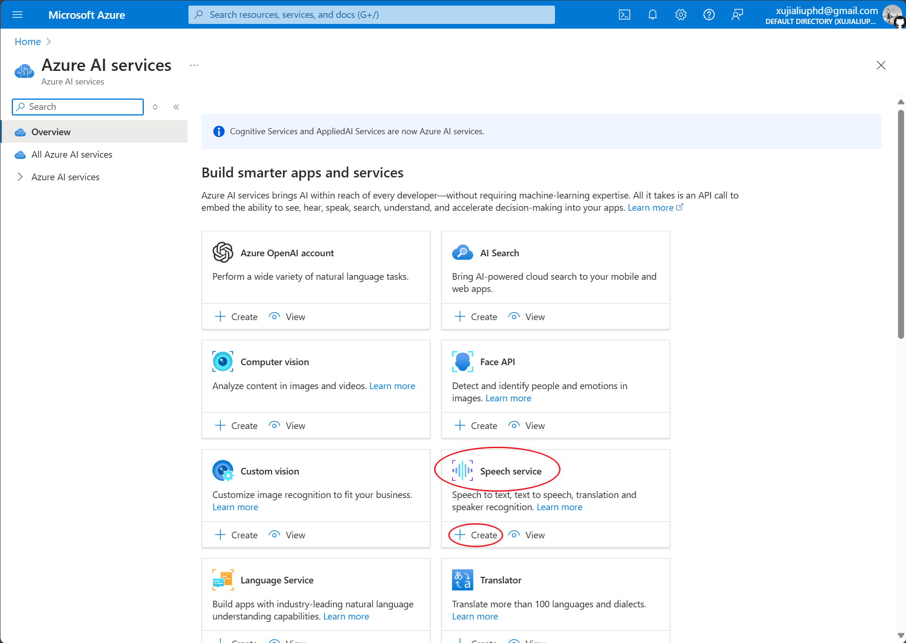
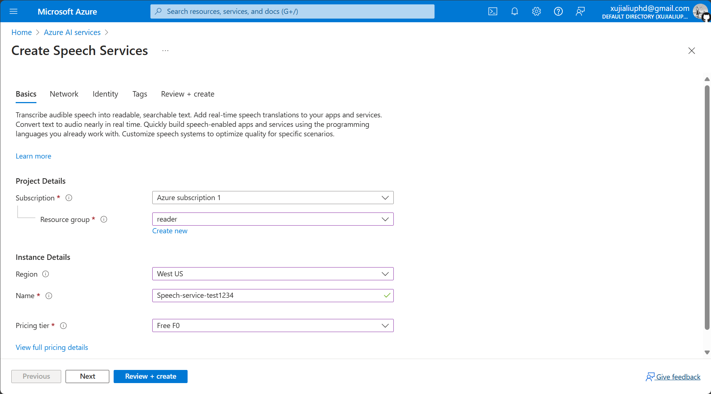
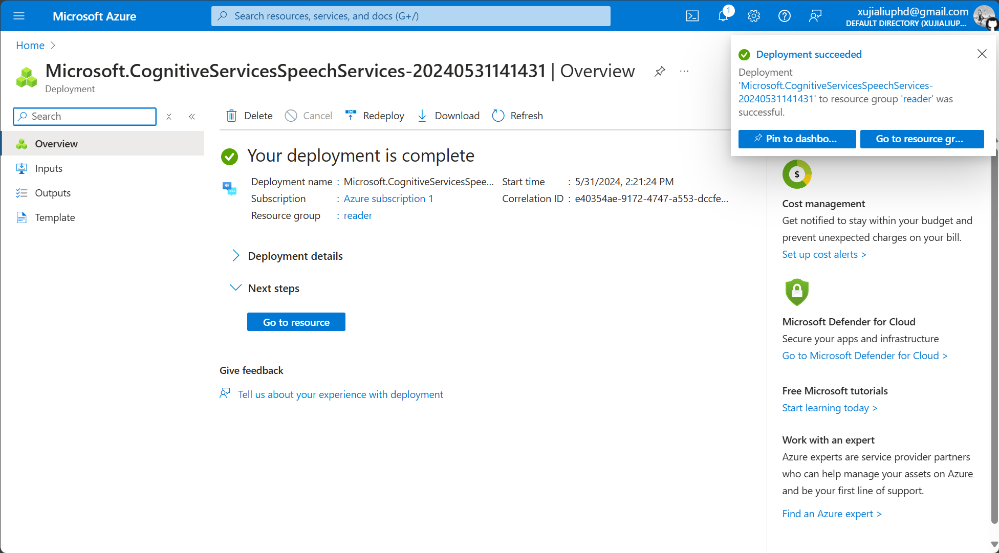
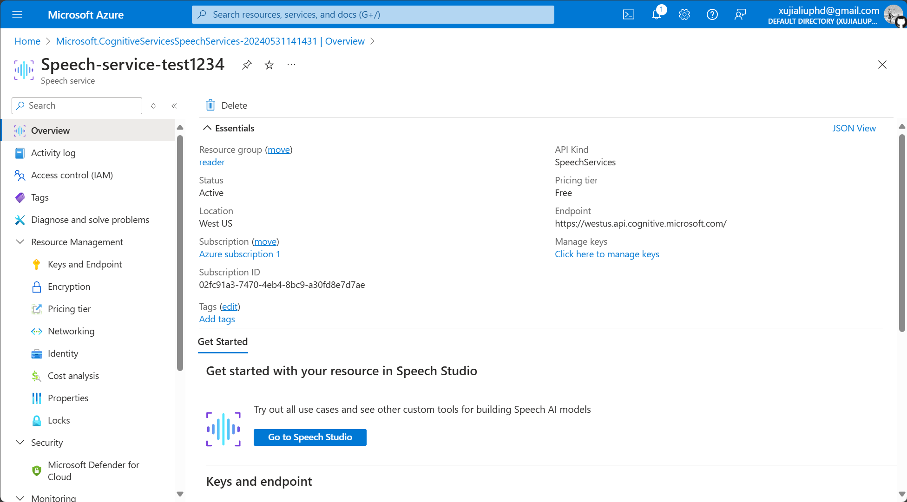
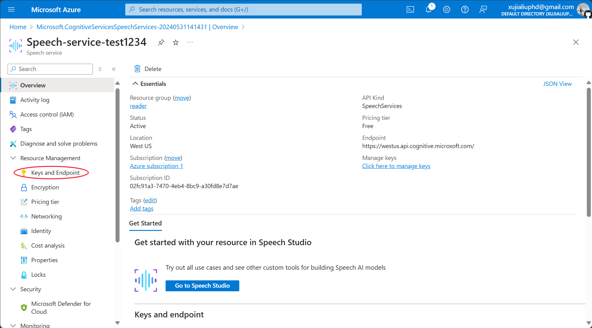
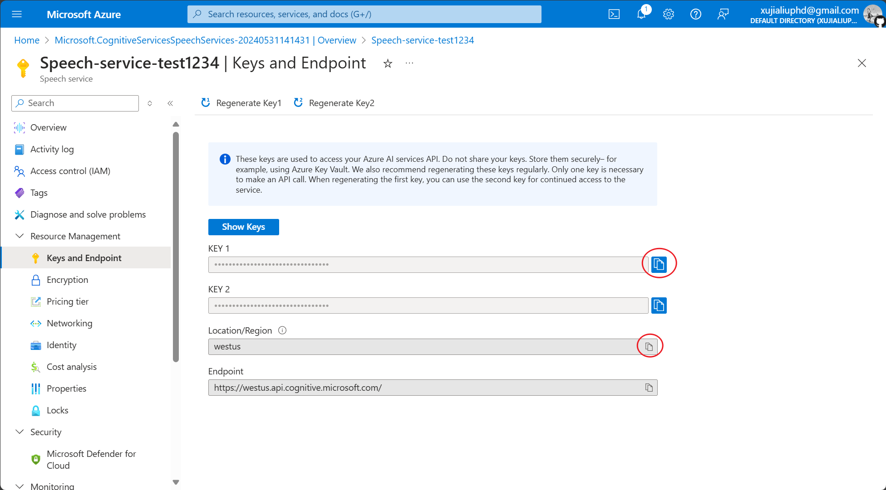
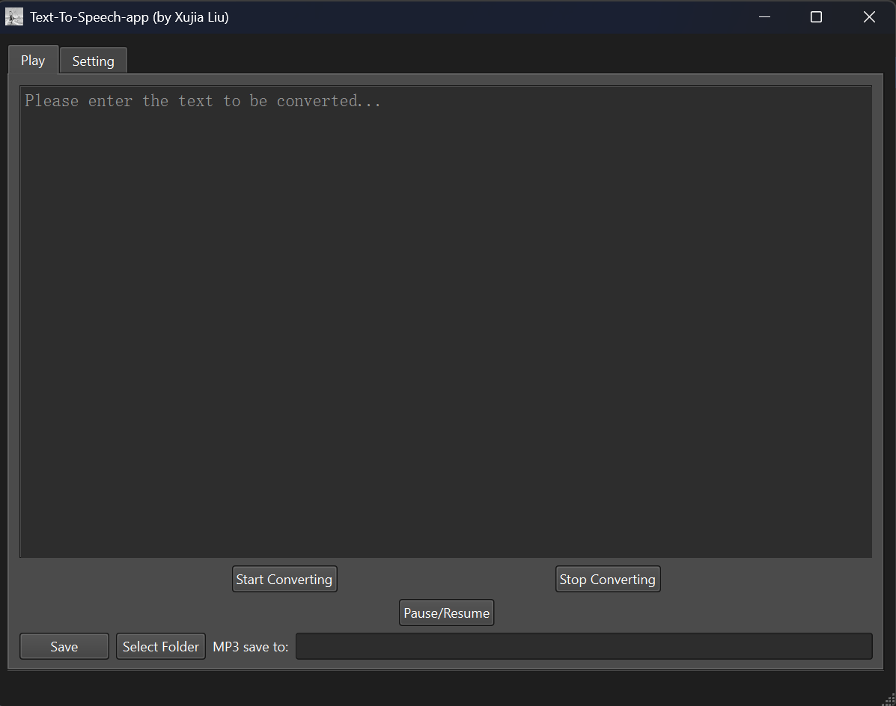

Obsidian Text-to-Audio Plugin.

  
  
  
  

## Documentation

[Simple Chinese Documentation](./README.zh.md) | [Traditional Chinese Documentation](./README.zht.md) | [English Documentation](./README.md)

## Changelog

[You can view recent changes here.](./changelog.md)

## Prerequisites

Before you start using this plugin, you need to apply for Microsoft's [Text-to-Speech Service](https://learn.microsoft.com/en-us/azure/ai-services/speech-service/index-text-to-speech) in advance.

## Installation and Configuration

You can configure the plugin by following these steps.

### Installation

- Please download the latest software from [this page](https://github.com/luhaifeng666/obsidian-text2audio/releases).

- Follow the prompts to install the software.

- Fill in the Speech key, Speech Region, and Directory. The acquisition methods for Speech key and Speech Region can be found in [this document](https://learn.microsoft.com/en-us/azure/ai-services/multi-service-resource?pivots=azportal&tabs=macos#get-the-keys-for-your-resource).

### Configuration
- You can quickly register or log in to **Microsoft Azure Cloud Services** via this [website](https://portal.azure.com/#home).

- After logging in, click on Azure AI services.
  

  
- Find the Speech service and click create to create a service instance.
  

  
- Create a Resource group (if this is your first time), then select the Region closest to you. Name must be unique across the network, so please name it longer, note: cannot contain spaces or _. Select the Free F0 for Pricing tier. Click Review + create, after the page redirects click Create.
  

  
- Wait a while for the instance to be created, then click Go to resource.
  

  
- Click on Keys and Endpoint in the left sidebar.
  

  
- Copy the KEY to Setting - Basic settings' Speech key, copy Location/Region to Speech Region.
  

  

  
- Select Language type and Voice type. If you find the speech rate too slow, you can speed up by setting Voice speed.
## How to Use
This plugin can be used in two ways: using hotkeys and directly.

### Using the Play tab window:

- Click Start converting: will begin converting the text in the text box and play it through the Speaker.
- Click Stop Converting: will stop converting and playing the speech.
- Click Pause / Resume: used to control pausing and resuming playback.
- Click Save: will save the audio file to the selected folder.

### Using Hotkeys

- Set Setting - Hotkeys
  - Start converting (clipboard text to speech): Trigger this hotkey to convert text from the clipboard into speech and play it through the Speaker.
  - Stop converting and playing: will stop converting and playing the speech.
  - Pause / Resume: used to control pausing and resuming playback.
