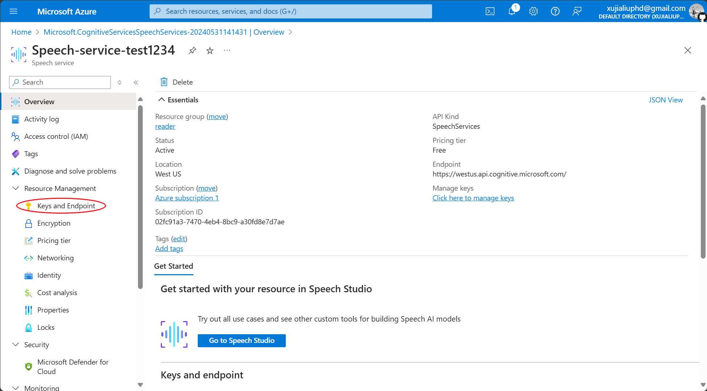

Obsidian 文本转音频插件。

  
  
  
  

## 文档

[中文文档](./README.zh.md) zht.md) | [英文文档](./README.md)

## 变更日志

[您可以在这里查看最近的变更。](./changelog.md)

## 先决条件

在开始使用此应用之前，您需要事先申请微软的[文本转语音服务](https://learn.microsoft.com/zh-cn/azure/ai-services/speech-service/index-text-to-speech)。

## 安装和配置

您可以按照以下步骤配置插件。

### 安装软件

- 请在[此页面](https://github.com/luhaifeng666/obsidian-text2audio/releases)下载最新的软件。

- 按提示安装软件。

- 填写 `Speech key`、`Speech Region` 和 `Directory`。其中，`Speech key`、`Speech Region` 的获取方式可以参考[本文档](https://learn.microsoft.com/zh-cn/azure/ai-services/multi-service-resource?pivots=azportal&tabs=macos#get-the-keys-for-your-resource)。

### 配置应用
- 您可以通过这个[网址](https://portal.azure.com/#home)快速注册或登录**微软Azure云服务**。

- 登录后，点击 `Azure AI services`。
  

  
- 找到 `Speech service` 后点击 `create`，创建一个服务实例。
  

  
- 创建一个 `Resource group`（如果是第一次使用），然后选择离您最近的 `Region`。`Name` 规定全网不能重复，所以请命名长一些，注意：不能有空格或 ` _` 等。`Pricing tier` 选择 `Free F0` 即可。点击 `Review + create`，页面跳转后点击 `Create`。
  

  
- 稍等一会儿等待实例创建，点击 `Go to resource`。
  

  
- 点击左侧侧边栏的 `Keys and Endpoint`。
  

  
- 复制 `KEY` 到 Setting - Basic settings 的 `Speech key`，复制 `Location/Region` 到 `Speech Region`。
  

  

  
- 选择`Language type`和`Voice type`。如果您觉得语速太慢, 可通过设置`Voice speed`提速。

## 如何使用
该插件有2种使用方式：使用热键和直接使用。

### 使用 Play tab 窗口:

- 点击Start converting: 将开始转换文本框的文字, 并播放到 Speaker。
- 点击Stop Converting: 将停止转换和播放语音。
- 点击Pause / Resume: 用于控制暂停和继续播放。
- 点击Save: 将保存音频文件到选中的文件夹。

### 使用热键

- 设置Setting - Hotkeys
  - Start converting (clipboard text to speech): 触发该热键，将剪切板的文本转换成语音, 并播放到 Speaker。
  - Stop converting and playing: 将停止转换和播放语音。
  - Pause / Resume: 用于控制暂停和继续播放。

